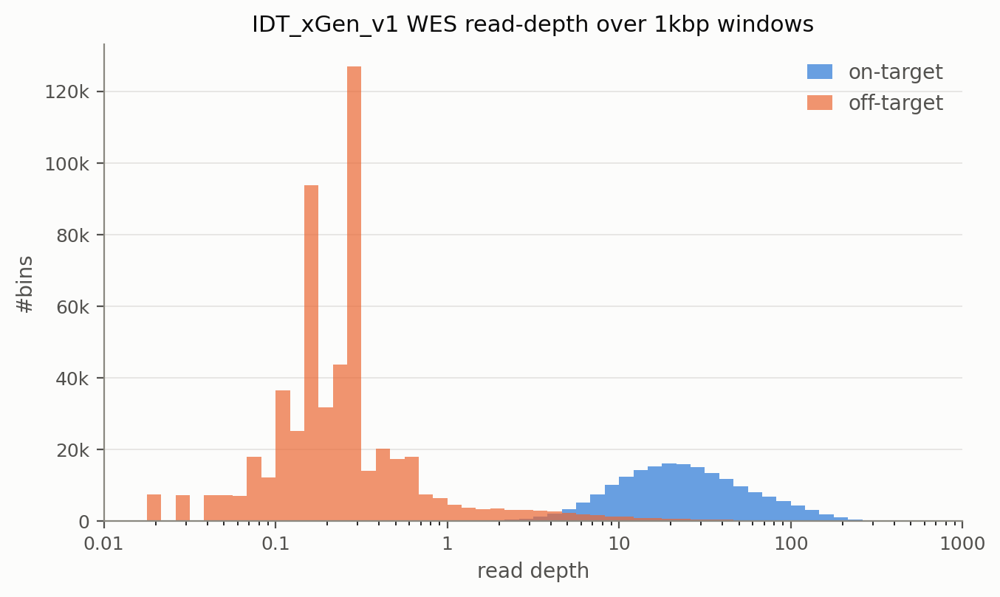

# Bulk Genotyping

This documentation covers input preparation and result intepretation for preprocessing **short-read** WGS/WES and/or **long-read** (e.g., PacBio HiFi, Oxford Nanopore) sequencing data to run [HATCHet](https://github.com/raphael-group/hatchet). Refer to the [README](../README.md) for Snakemake pipeline installation and execution instructions.

## Table of Contents
1. [Overview](#overview) <br>
2. [Input](#input) <br>
3. [Output](#output) <br>

## Overview

The rule graph below shows the stages of the bulk genotyping workflow.

<p align="center">
  
</p>

### Features
- Joint genotyping and segmentation across multiple bulk samples of mixed **short-reads** and **long-reads** DNA sequencing platforms on one shared genomic bin coordinates.
- Large data hosted on cloud or FTP servers can be streamed rather than download to local storage. (`remote_mode=stream`).
- Sequencing read-depth bias correction (GC-content, mappability, replication timing).
- Multi-sample adaptive genomic bin segmentation to achieve sufficient count statistics.

## Input

### Sample file
A sample sheet in JSON format records one or more samples representing patients or cell lines identified by `sample_id`. Each sample can have one or more datasets representing multiple sequencing runs collected from same sample identified by `dataset_id`. Detailed JSON format can be found at [sample_sheet.md](./sample_sheet.md), Here is an example for one tumor WGS dataset `T1` with matched normal WGS sample `N1` from patient `HT001`.

```json
{
  "version": 1,
  "samples": [
    {
      "sample_id": "HT001",
      "dataset_id": "N1",
      "assay_type": "bulkWGS",
      "sample_type": "normal",
      "files": {
        "alignment": "/data/HT001/normal.bam",
        "alignment_index": "/data/HT001/normal.bam.bai"
      }
    },
    {
      "sample_id": "HT001",
      "dataset_id": "T1",
      "rdr_base_dataset_id": "N1",
      "assay_type": "bulkWGS",
      "sample_type": "tumor",
      "files": {
        "alignment": "/data/HT001/tumor.cram",
        "alignment_index": "/data/HT001/tumor.cram.crai"
      }
    }
  ]
}
```

> [!IMPORTANT]
> - (`sample_id`, `dataset_id`) must uniquely define a dataset.
> - alignment file (`alignment`) must be sorted, and its index file (`alignment_index`) must present.

### Config file

A Snakemake config file is required to specify the runtime configurations. Copy the [template](../resources/templates/config.yaml) and adjust following parameters. detailed description can be found at [reference.md](reference.md#configuration).

1. specify workflow mode, assay types (`assay_types`), and patient informations.

```yaml
workflow_mode: "bulk_genotyping"
assay_types: ["bulkWGS"]

sample_id: HT001
sample_file: /path/to/samples.json
chromosomes: [1, 2, 3, 4, 5, 6, 7, 8, 9, 10, 11, 12, 13, 14, 15, 16, 17, 18, 19, 20, 21, 22]
```

2. specify the paths to reference files, see [../resources/README.md](../resources/README.md) for detailed descriptions for pre-built reference files. Only datasets with `reference_version` recorded in config will be processed.

```yaml
species: human
reference_version: hg38
reference: /path/to/reference.fasta
genome_size: resources/data/hg38.chrom.sizes
region_bed: resources/data/hg38.regions.bed
extremity_tsv: null
window_bed: resources/data/windows.1kbp.hg38.bed.gz
mappability_bed: /path/to/k100.Umap.MultiTrackMappability.bed.gz
blacklist_bed: resources/data/hg38-blacklist.v2.bed.gz
gene_blacklist_file: resources/data/ig_gene_list.txt
gtf_file: /path/to/gencode.v38.annotation.gtf.gz
```

> [!TIP]
> Set `extremity_tsv` to a TSV of upstream SV breakpoints and no window or bb will span an
> SV junction; see [`extremity_tsv`](reference.md#file-paths).

3. specify the population germline SNP panel (`snp_panel`) for germline SNP genotyping (`genotype_dataset_ids`, preferred matched-normal samples) via [bcftools](https://github.com/samtools/bcftools).

By default (`panel_allele_only` is true), the workflow consider only SNPs with both alleles matched with panel's allele. If `panel_allele_only` set to false, the workflow allow genotype SNPs at panel's positions with different ALT allele as listed in the panel. See [snp-panels](../resources/README.md#snp-panels) for the format requirements and pre-built panels.

```yaml
snp_panel: /path/to/snps.vcf.gz
```

If matched-normal sample does not exists, set `genotype_dataset_ids` to one of the bulk tumor sample with normal cells admixture to distinguish SNPs either homozygous or heterozygous LOH. 
If only tumor cell-line dataset is available, set `params_combine_counts.detect_loh_tumor_cell_line: true` such that `combine_counts` detects the clonal LOH region based on Het SNP density. See `<qc_dir>/detect_loh.pdf`.

> [!TIP]
> - If a set of confident germline (phased) Het SNPs already exist, user may specify the path via `het_snp_vcf` and set `het_snp_vcf_phased` to indicate if the VCF file is phased or not. This will skip the germline SNP genotyping (and haplotype phasing if `het_snp_vcf_phased=true`).
> - For long-read datasets, set `params_bcftools.extra_params` to the matching bcftools mpileup platform preset so genotyping and pileup use the correct long-read error model: `-X ont-sup` (Oxford Nanopore) or `-X pacbio-ccs` (PacBio HiFi). Run `bcftools mpileup -X list` for all available profiles.

4. our pipeline supports various haplotype phasing softwares:
- For short-read phasing via [Eagle2](https://github.com/poruloh/Eagle) (preferred) and [Shapeit5](https://github.com/odelaneau/shapeit), genetic map file (`gmap_path`, see [genetic-maps](../resources/README.md#genetic-maps)) and population haplotype panel (`phasing_panel`, see [population-haplotype-panels](../resources/README.md#population-haplotype-panels)) are required. 
- For long-read phasing via [LongPhase](https://github.com/twolinin/longphase), genetic map and haplotype panel are ignored, all matched-normal long-read data will be used as input. Set `params_longphase.extra_params` according to specific long-read sequencing technology (e.g., `"--pb"` for Pacbio HiFi).

Here is an example for Eagle2:
```yaml
phaser: "eagle"
phasing_panel: /path/to/1kGP_3202_hg38/phasing_panel
gmap_path: /path/to/Eagle_v2.4.1/tables/genetic_map_hg38_withX.txt.gz
```

5. For each dataset, our pipeline (by default) performs read-depth sequencing bias correction (`rd_correct_method`, default: median regression) against covariates including GC-content and replication timing (RT). User may disable them:

```yaml
params_count_reads:
  gc_correct: false
  rt_correct: false
```

> [!NOTE]
> user should inspect the effects via `<qc_dir>/rd_correction.pdf`.
> Repli-seq covariate is only applicable to `hg19`, `hg38`, or `chm13v2`.

6. The final step performs adaptive binning over the fixed bins jointly across all tumor datasets and obtain genomic bin by dataset read-depth ratio (RDR), phased B-allele counts, and total-allele counts. Each value in the minimum-SNP-covering reads parameter (`min_snp_reads`) gives one binning result. We recommend user to set `min_snp_reads` to a list of values and inspect the QC plots at `<qc_dir>/combine_counts.{stats,1d2d}.bulk.MSR{msr}.pdf` for varying `min_snp_reads`, then pick the lowest value that gives reliable BAF and RDR signals.
```yaml
params_combine_counts:
  min_snp_reads: [100, 500, 1000, 2000, 3000, 5000, 7500, 10000]
  min_total_reads: 5000 # read starts per bb per dataset; 0 disables
```

> [!TIP]
> 1. For high-coverage (>=30x) data, we recommend to use `min_snp_reads>1000&<=5000`.
> 2. For low-coverage/targeted data, we recommend to use `min_snp_reads>50&<=200`.

### Whole-exome sequencing (WES)

WES has highly un-uniform read depth at on-target and off-target regions. Here is an example for normal WES sample over 1kbp windows, we see a bimodal read-depth pattern.

<p align="center">
  
</p>

If any `bulkWES` datasets are included, set `target_bed` based on capture kit's target intervals. `rd_correct` then

1. fits the read-depth bias correction on- and off-target separately, for each `bulkWES` dataset;
2. applies one library-size factor per (dataset, capture group), rescaling every bulk dataset to a common depth level inside each group.

We also recommend `lowess` over the default `median` fit for WES:

```yaml
# IDT xGen v1 (hg38) ships with the pipeline
target_bed: resources/data/targets.IDT_xGen_v1.hg38.bed.gz
params_count_reads:
    rd_correct_method: "lowess"
```

See [capture targets](../resources/README.md#capture-targets-wes) for more details.

## Output

Refer to [Final bins](reference.md#final-bins) for the full specification of each file:

```text
<out_dir>/
  ...
  pileup/
    {assay_type}/
      {dataset_id}.rdcount.bed.gz      # per-window read-start counts, #CHR START END COUNT
  bb/
    unit/
      bulk/                            # the un-binned grids, MSR-independent
        snp.{tsv.gz,Tallele.npz,Aallele.npz,Ballele.npz}   # per-SNP allele counts
        window.{tsv.gz,depth.npz}      # per-window bias-corrected depth
        window.rdcount.npz             # per-window read starts, windows x samples
        sample_ids.tsv                 # one row per sample, in matrix-column order
    MSR{msr}/                          # one subdir per min_snp_reads value
      bulk/                            # one joint bb set over all bulk assays (WGS/WGS-lr/WES)
        bb.tsv.gz                      # bb annotations (shared by every matrix below)
        bb.{Tallele,Aallele,Ballele}.npz   # phased allele counts, bins x samples
        bb.{depth,rdr}.npz             # read depth (all samples) and RDR (tumor columns)
        bb.rdcount.npz                 # read starts (all samples)
        sample_ids.tsv                 # one row per sample, in matrix-column order
    multi_snp/
      bulk/                            # multi-SNP diagnostic groups, MSR-independent, bb schema
  qc/
    genotype_snps.pdf                          # SNP allele frequency by called genotype
    detect_loh.pdf                             # clonal-LOH decode (detect_loh_tumor_cell_line only)
    phase_and_concat.bulk.pdf                  # SNP allele frequency + per-dataset depth (phase_and_concat)
    rd_correction.pdf                          # read-depth bias correction, one panel per dataset
    combine_counts.stats.bulk.MSR{msr}.pdf     # bb-length histogram + one raw-count page per dataset, one per min_snp_reads value
    combine_counts.1d2d.bulk.MSR{msr}.pdf      # genome-wide RDR/BAF + RDR-vs-BAF 2D, one per min_snp_reads value
```
