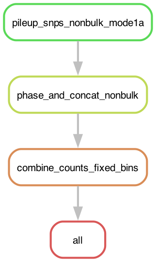

# Copytyping Preprocess

This documentation covers input preparation and result interpretation for the copytyping preprocess mode, which aggregates single-cell / spatial (**scRNA**, **scATAC**, **Visium**) allele and native counts onto a **pre-computed** set of copy-number blocks to run [CalicoST](https://github.com/raphael-group/CalicoST). This mode never genotypes or phases: a pre-computed phased het-SNP VCF (`het_snp_vcf`) and the genomic bin annotations (`bb_file`) are **required** inputs from running genotyping using matched bulk samples. Refer to [Installation](installation.md) and [run.md](./run.md) for Snakemake pipeline installation and execution instructions.

<p align="center">
  
</p>

## Table of Contents
1. [Input](#input) <br>
2. [Output](#output) <br>

## Input

### Sample file
A sample sheet in JSON format is required to specify the locations and data configurations for input datasets. Detailed JSON format can be found at [sample_sheet.md](./sample_sheet.md). Here is an example for a 10x Epi Multiome dataset `U1` (one `scRNA` record and one `scATAC` record sharing the `dataset_id`) from patient `HT001`.

```json
{
  "version": 1,
  "samples": [
    {
      "sample_id": "HT001",
      "dataset_id": "U1",
      "assay_type": "scRNA",
      "sample_type": "tumor",
      "files": {
        "alignment": "/data/HT001/multiome/outs/gex_possorted_bam.bam",
        "alignment_index": "/data/HT001/multiome/outs/gex_possorted_bam.bam.bai",
        "barcodes": "/data/HT001/multiome/outs/filtered_feature_bc_matrix/barcodes.tsv.gz",
        "matrix_h5": "/data/HT001/multiome/outs/filtered_feature_bc_matrix.h5"
      }
    },
    {
      "sample_id": "HT001",
      "dataset_id": "U1",
      "assay_type": "scATAC",
      "sample_type": "tumor",
      "files": {
        "alignment": "/data/HT001/multiome/outs/atac_possorted_bam.bam",
        "alignment_index": "/data/HT001/multiome/outs/atac_possorted_bam.bam.bai",
        "barcodes": "/data/HT001/multiome/outs/filtered_feature_bc_matrix/barcodes.tsv.gz",
        "fragments": "/data/HT001/multiome/outs/atac_fragments.tsv.gz"
      }
    }
  ]
}
```

> [!IMPORTANT]
> Here are a few important constraints for sample files:
> - All alignment files must come from same reference version.
> - Each tuple (`sample_id`, `dataset_id`) defines a unique dataset; a multiome pair shares one `dataset_id`, one `scRNA` and one `scATAC` record.
> - BAM file (`alignment`) must be sorted, and its index file (`alignment_index`) must present!
> - Each assay reads a specific set of `files` (`barcodes`, `fragments`, `matrix_h5`, etc.,); see [sample_sheet.md](sample_sheet.md#files) for the per-assay requirement.

### Config file

A Snakemake config file is required to specify the runtime configurations. Copy the [template](../resources/templates/config.yaml) and adjust following parameters. detailed description can be found at [reference.md](reference.md#configuration).

1. specify workflow mode, assay types (`assay_types`), and patient informations.

```yaml
workflow_mode: "copytyping_preprocess"
assay_types: ["scRNA", "scATAC"]

sample_id: HT001
sample_file: /path/to/samples.json
chromosomes: [1, 2, 3, 4, 5, 6, 7, 8, 9, 10, 11, 12, 13, 14, 15, 16, 17, 18, 19, 20, 21, 22]
```

2. specify the paths to reference files. Commonly used reference versions for human (`hg19`, `hg38`, `T2T-CHM13v2.0`) and mouse (`mm10`) have pre-built files at [../resources/data/](../resources/data/). Here is an example configuration for `hg38`. See [../resources/README.md](../resources/README.md) for detailed descriptions and public URLs.

```yaml
reference_version: hg38
reference: /path/to/reference.fasta
genome_size: resources/data/hg38.chrom.sizes
region_bed: resources/data/hg38.regions.bed
gtf_file: /path/to/gencode.v38.annotation.gtf.gz
gene_blacklist_file: resources/data/ig_gene_list.txt
```

3. specify the pre-computed phased het-SNP VCF (`het_snp_vcf`) and the copy-number block annotations (`bb_file`). Both are **required** in this mode: genotyping and phasing are skipped, and the counts are aggregated onto the given blocks. A natural source is a prior `bulk_genotyping` run of the same patient (its `phase/phased_het_snps.vcf.gz` and a `bb.tsv.gz`).

```yaml
het_snp_vcf: /path/to/phased_het_snps.vcf.gz
het_snp_vcf_phased: true
bb_file: /path/to/bb.tsv.gz
```

> [!IMPORTANT]
> `het_snp_vcf` must be **phased** in this mode: `het_snp_vcf_phased` defaults to `true` and setting it `false` is a parse-time error. This mode never phases, so an unphased VCF cannot be used here; phase it first (e.g. via a `bulk_genotyping` or `single_cell_genotyping` run) and pass the phased VCF.

## Output

Here we show the key results and visualizations from copytyping preprocess.

```text
<out_dir>/
  bb/
    {assay_type}.h5ad                          # gene x cell AnnData (scRNA/VISIUM)
    {assay_type}/                              # per assay, flat (no MSR{msr}/ layer)
      cnv_segments.tsv                         # BB block annotations
      bb.{Xcount,Tallele,Aallele,Ballele}.npz # per-block native + phased allele counts, blocks x cells
      barcodes.tsv.gz                          # {BARCODE}_{REP_ID} per row
      barcodes.full.tsv.gz                     # REP_ID, BARCODE columns
      sample_ids.tsv                           # one row per replicate x assay, in matrix-column order
  qc/
    phase_and_concat.{assay_type}.pdf          # SNP allele frequency + depth histogram
    combine_counts_fixed_bins.{assay_type}.pdf # SNP- and BB-level BAF
```

Output is per assay and flat: because the blocks come from `bb_file`, no binning rule runs and there is no `MSR{msr}/` layer. Every `.npz` is a scipy sparse CSR matrix whose rows are the blocks of `cnv_segments.tsv` (same order) and whose columns are the cells of `barcodes.tsv.gz` (same order); BAF is never stored, derive it as `Ballele / Tallele`. Refer to [Final bins](reference.md#final-bins) for the full per-file contract.

### `cnv_segments.tsv`

BB block annotations, one row per block; the grid (from `bb_file`) shared by every `bb.*.npz`, its row order defining the matrix rows. Refer to [TSV columns](reference.md#tsv-columns) for the column definitions.

### `bb.Tallele.npz`, `bb.Aallele.npz`, `bb.Ballele.npz`

Per-block phased allele-count matrices (blocks x cells). Inspect `qc/combine_counts_fixed_bins.{assay_type}.pdf` for SNP- and BB-level BAF, and `qc/phase_and_concat.{assay_type}.pdf` for the SNP-level allele frequency and depth.

### `bb.Xcount.npz`

Native per-block signal, same shape and column order as the allele matrices: scATAC deduped fragment counts (each fragment counted once by its midpoint, from the raw fragments), scRNA/VISIUM UMI counts from the h5ad (each gene assigned to its largest-overlap block).

### `barcodes.tsv.gz`, `barcodes.full.tsv.gz`

Per-assay cell barcodes in matrix-column order. Refer to [Barcodes](reference.md#barcodes-single-cell) for the exact formats.

### `{assay_type}.h5ad`

Gene x cell AnnData built from the RNA/spatial count matrix (scRNA / VISIUM). Source of the `bb.Xcount.npz` UMI counts.

### `sample_ids.tsv`

One row per replicate x assay, its row order matching the matrix columns. Refer to [TSV columns](reference.md#tsv-columns) for the column definitions.
