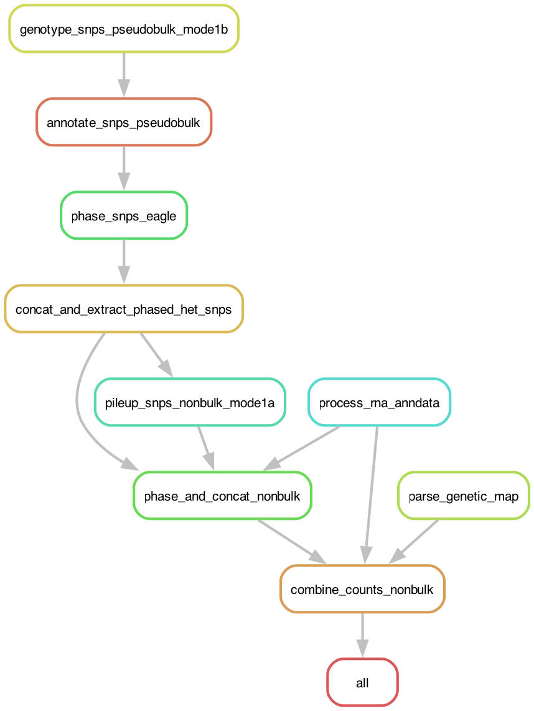

# Single-Cell Genotyping

This documentation covers input preparation and result interpretation for single-cell and spatial genotyping using **scRNA**, **scATAC** (incl. 10x Epi Multiome), and **Visium** (`VISIUM`/`VISIUM3prime`) data to run [CalicoST](https://github.com/raphael-group/CalicoST). Germline SNPs are genotyped from a pseudobulk of the sample's own cells (cellsnp-lite), phased, then pileup-counted per cell. Refer to the [README](../README.md) for Snakemake pipeline installation and execution instructions.

## Table of Contents
1. [Overview](#overview) <br>
2. [Input](#input) <br>
3. [Output](#output) <br>

## Overview

The rule graph below shows the stages of the single-cell genotyping workflow.

<p align="center">
  
</p>

## Input

### Sample file
A sample sheet in JSON format is required to specify the locations and data configurations for input datasets. Detailed JSON format can be found at [sample_sheet.md](./sample_sheet.md). Here is an example for a 10x Epi Multiome dataset `U1` from patient `HT001`.

```json
{
  "version": 1,
  "samples": [
    {
      "sample_id": "HT001",
      "dataset_id": "U1",
      "assay_type": "scRNA",
      "sample_type": "tumor",
      "files": {
        "alignment": "/data/HT001/multiome/outs/gex_possorted_bam.bam",
        "alignment_index": "/data/HT001/multiome/outs/gex_possorted_bam.bam.bai",
        "barcodes": "/data/HT001/multiome/outs/filtered_feature_bc_matrix/barcodes.tsv.gz",
        "matrix_h5": "/data/HT001/multiome/outs/filtered_feature_bc_matrix.h5"
      }
    },
    {
      "sample_id": "HT001",
      "dataset_id": "U1",
      "assay_type": "scATAC",
      "sample_type": "tumor",
      "files": {
        "alignment": "/data/HT001/multiome/outs/atac_possorted_bam.bam",
        "alignment_index": "/data/HT001/multiome/outs/atac_possorted_bam.bam.bai",
        "barcodes": "/data/HT001/multiome/outs/filtered_feature_bc_matrix/barcodes.tsv.gz",
        "fragments": "/data/HT001/multiome/outs/atac_fragments.tsv.gz"
      }
    }
  ]
}
```

> [!IMPORTANT]
> Here are a few important constraints for sample files:
> - All alignment files must come from same reference version.
> - Each tuple (`sample_id`, `dataset_id`) defines a unique dataset.
> - A multiome paired dataset share the same `dataset_id`, one `scRNA` and one `scATAC` record.
> - BAM file (`alignment`) must be sorted, and its index file (`alignment_index`) must present!
> - Each assay reads a specific set of `files` (`barcodes`, `fragments`, `matrix_h5`, `tissue_positions`, `scalefactors`, `image_hires`, `image_lowres`); see [sample_sheet.md](sample_sheet.md#files) for the per-assay requirement.

### Config file

A Snakemake config file is required to specify the runtime configurations. Copy the [template](../resources/templates/config.yaml) and adjust following parameters. detailed description can be found at [reference.md](reference.md#configuration).

1. specify workflow mode, assay types (`assay_types`), and patient informations.

```yaml
workflow_mode: "single_cell_genotyping"
assay_types: ["scRNA", "scATAC"]

sample_id: HT001
sample_file: /path/to/samples.json
chromosomes: [1, 2, 3, 4, 5, 6, 7, 8, 9, 10, 11, 12, 13, 14, 15, 16, 17, 18, 19, 20, 21, 22]
```

2. specify the paths to reference files. Commonly used reference versions for human (`hg19`, `hg38`, `T2T-CHM13v2.0`) and mouse (`mm10`) have pre-built files at [../resources/data/](../resources/data/). Here is an example configuration for `hg38`. See [../resources/README.md](../resources/README.md) for detailed descriptions and public URLs.

```yaml
reference_version: hg38
reference: /path/to/reference.fasta
genome_size: resources/data/hg38.chrom.sizes
region_bed: resources/data/hg38.regions.bed
gtf_file: /path/to/gencode.v38.annotation.gtf.gz
gene_blacklist_file: resources/data/ig_gene_list.txt
```

3. specify the population SNP panel (`snp_panel`) for germline SNP genotyping. Unlike bulk mode, single-cell genotyping piles up a pseudobulk of all datasets of a modality with cellsnp-lite over `snp_panel` (no `snp_targets`). See [snp-panels](../resources/README.md#snp-panels) for details.

```yaml
snp_panel: /path/to/snp_panel.vcf.gz
```

4. our pipeline supports various haplotype phasing softwares (`phaser`) including Eagle2, Shapeit5, and LongPhase. For short-read phasing via Eagle2 and Shapeit5, genetic map file (`gmap_path`, see [genetic-maps](../resources/README.md#genetic-maps)) and population haplotype panel (`phasing_panel`, see [population-haplotype-panels](../resources/README.md#population-haplotype-panels)) are required.

```yaml
phaser: "eagle"
phasing_panel: /path/to/1kGP_3202_hg38/phasing_panel
gmap_path: /path/to/Eagle_v2.4.1/tables/genetic_map_hg38_withX.txt.gz
```

> [!NOTE]
> If germline (phased) Het SNPs information already exist, user may specify the path via `het_snp_vcf` and set `het_snp_vcf_phased` to indicate if the VCF file is phased. This skips genotyping (and phasing if `het_snp_vcf_phased=true`). To reuse a bulk run's SNPs, point `het_snp_vcf` at its `phase/phased_het_snps.vcf.gz`.

5. the final step performs adaptive binning jointly across all non-bulk assays of the sample on one shared bin grid, emitting phased B-allele and total-allele count matrices plus native per-bin signal (`bb.Xcount.npz`). Each value in the minimum-SNP-covering reads parameter (`min_snp_reads`) gives one segmentation result; we recommend setting a list of values and picking the smallest that gives reliable BAF signals.

```yaml
params_combine_counts:
  min_snp_reads: [500, 1000, 3000, 5000, 10000]
```

## Output

Refer to [Final bins](reference.md#final-bins) for the full specification of each file:

```text
<out_dir>/
  bb/
    {assay_type}.h5ad                          # gene x cell AnnData (scRNA/VISIUM), MSR-independent
    MSR{msr}/                                   # one subdir per min_snp_reads value
      {assay_type}/                             # one subdir per assay; shared grid duplicated into each
        bb.tsv.gz                              # bin annotations (grid shared by every matrix below)
        bb.{Tallele,Aallele,Ballele}.npz       # phased allele counts, bins x cells
        bb.Xcount.npz                          # native counts (scATAC fragments / RNA UMIs)
        multi_snp.tsv.gz                       # multi-SNP diagnostic groups (MSR-independent)
        multi_snp.{Tallele,Aallele,Ballele}.npz
        barcodes.tsv.gz                        # {BARCODE}_{REP_ID} per row
        barcodes.full.tsv.gz                   # REP_ID, BARCODE columns
        sample_ids.tsv                         # one row per replicate x assay, in matrix-column order
  qc/
    phase_and_concat.{assay_type}.pdf          # SNP allele frequency + depth histogram
    combine_counts.{assay_type}.MSR{msr}.pdf   # binning QC, one per min_snp_reads value
```
